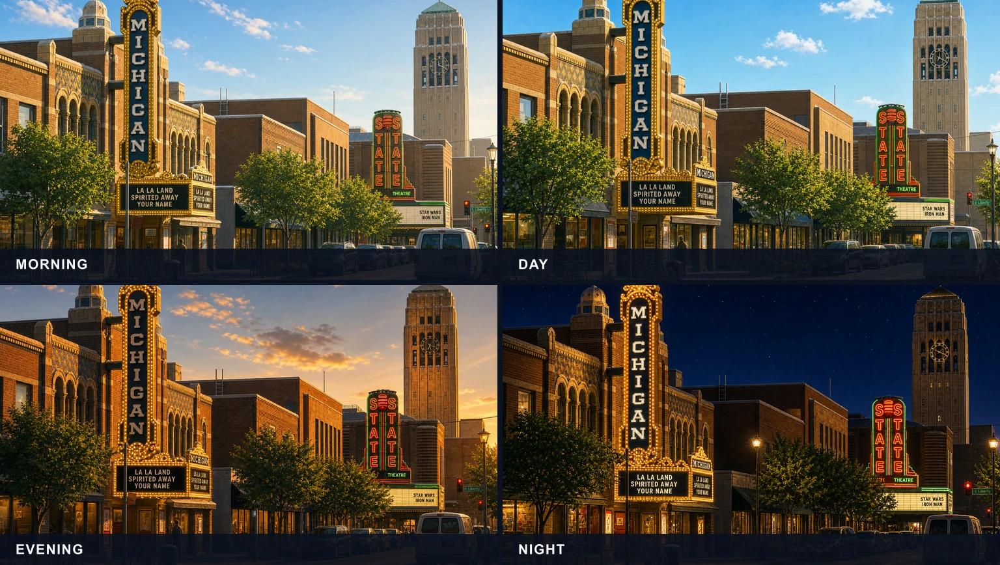
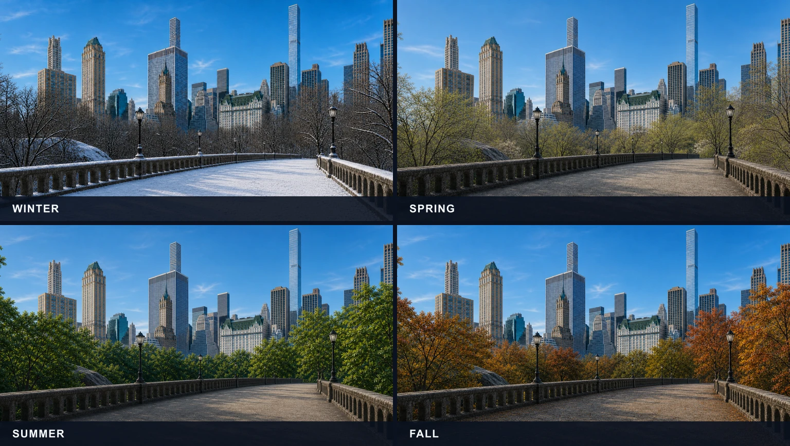
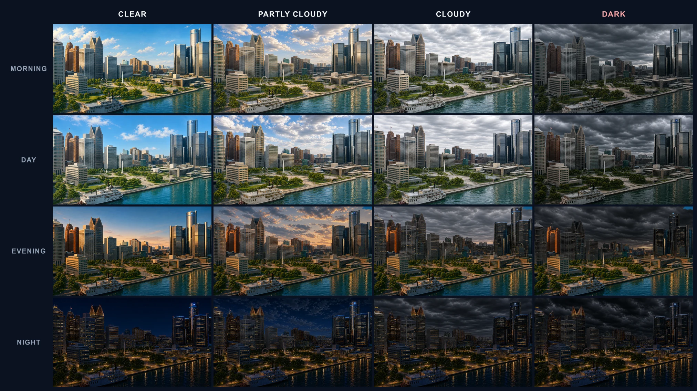

# Generative Image Pipeline

A controlled, model-agnostic production pipeline for generative image assets.

Image models are nondeterministic. Shipping image families does not have to be. This project turns prompt matrices and reference images into inspectable plans, resumable generation jobs, normalized candidates, review sheets, approval records, validation reports, and gated release manifests.

## Production examples

### Time of day: Ann Arbor



<p align="center"><sub>One approved summer composition across four clear-weather time segments.</sub></p>

### Season: New York City



<p align="center"><sub>One clear daytime composition across winter, spring, summer, and fall.</sub></p>

### Full QA matrix: Detroit



<p align="center"><sub>Rows vary time of day. Columns vary clear, partly cloudy, cloudy, and dark weather states.</sub></p>

These image families grew out of the production background system on [anthonywohlfeil.com](https://anthonywohlfeil.com).

## What it solves

Generating one image is easy. Producing a coherent set of assets across locations, seasons, times, products, or campaign states is harder:

- Prompts drift between variants.
- Files are misnamed or silently missing.
- Retrying a run can overwrite good candidates.
- Images arrive with inconsistent dimensions and formats.
- Review decisions are detached from the inputs that produced them.
- Unapproved assets can accidentally reach production.

This pipeline makes those failure modes explicit.

## Workflow

```text
manifest
  -> stable generation plan
  -> model, agent, or fixture adapter
  -> raw candidates
  -> deterministic normalization
  -> metadata and duplicate validation
  -> contact sheet
  -> human approval
  -> gated release manifest
```

See [Architecture](docs/architecture.md) for the complete system boundary.

## Quick start

Requirements: Node.js 22 or newer and pnpm 10.

```bash
pnpm install
pnpm demo
```

The offline demo generates eight deterministic fixtures and writes the complete run to `output/demo/`:

```text
output/demo/
  plan.json
  raw/
  candidates/
  validation.json
  contact-sheet.png
  approvals.json
  release-manifest.json
  run-report.json
```

No API key or network request is required for the demo.

## Real agent-assisted run

Start with the manual adapter:

```bash
pnpm gip run \
  --manifest examples/seasonal-scenes/pipeline.json \
  --work-dir work/seasonal \
  --provider manual
```

The first run writes generation packages to `work/seasonal/requests/`. Generate each image with Codex or another tool, then place it in `work/seasonal/inbox/` using the requested filename. Rerun the command to import, normalize, validate, and create a contact sheet.

After reviewing the contact sheet, edit `approvals.json` or approve the complete set:

```bash
pnpm gip approve --work-dir work/seasonal --all
pnpm gip run \
  --manifest examples/seasonal-scenes/pipeline.json \
  --work-dir work/seasonal \
  --provider manual
```

The release manifest is written only when validation and approval policies pass.

## Direct OpenAI generation

The OpenAI adapter uses `gpt-image-2` through the Image API, with the dated snapshot pinned in the example manifest. Reference-driven jobs use image editing; text-only jobs use image generation. Paid calls require explicit confirmation.

```bash
OPENAI_API_KEY=... pnpm gip run \
  --manifest examples/seasonal-scenes/pipeline.json \
  --work-dir work/seasonal \
  --provider openai \
  --confirm-cost
```

See [Generation adapters](docs/adapters.md) for details.

## Manifest model

```json
{
  "version": 1,
  "name": "seasonal-scenes",
  "variants": [
    {
      "id": "coast",
      "references": ["references/coast.png"],
      "variables": { "subject": "a coastal overlook" }
    }
  ],
  "axes": {
    "season": ["spring", "winter"],
    "time": ["morning", "night"]
  },
  "promptTemplate": "Create {{subject}} in {{season}} during {{time}}.",
  "namingTemplate": "{{id}}_{{season}}_{{time}}.png",
  "output": {
    "width": 1536,
    "height": 1024,
    "fit": "cover",
    "format": "png"
  }
}
```

Every matrix combination becomes a job with stable prompt and configuration hashes. Approvals are tied to the resulting plan hash, so changing a prompt or output contract invalidates stale review decisions.

## Safety choices

- Paid API generation requires `--confirm-cost`.
- API keys are read from the environment and never written to reports.
- Raw inputs, inboxes, outputs, and work directories are ignored by git.
- Filenames are generated from templates and rejected if they contain path traversal.
- Release manifests are blocked by missing, malformed, duplicated, rejected, or pending assets.

## Development

```bash
pnpm check
pnpm test
pnpm build
```

CI runs type checking, unit tests, compilation, and the complete offline demo.

## Origin

This project was extracted from a real seasonal website-background workflow. The production pipeline needed consistent compositions across locations, times of day, weather states, and seasons while keeping a human in control of what shipped. The public example replaces all personal photographs and production storage details with synthetic fixtures.

## License

MIT
