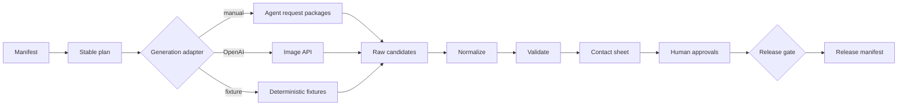

# Architecture

The pipeline treats image generation as one replaceable stage inside a larger production system.

## Deterministic boundary

Model output is not deterministic. Everything around it is designed to be inspectable and repeatable:

- Matrix expansion preserves manifest order.
- Every prompt receives a SHA-256 hash.
- Every job receives a fingerprint covering prompt, references, and output settings.
- Existing raw candidates are never regenerated unless removed intentionally.
- Normalization produces fixed dimensions and formats.
- Validation records hashes, metadata, missing files, and duplicates.
- Approvals are bound to a plan hash.
- Release manifests contain only validated and approved assets.

## Repository boundary

This repository deliberately excludes real production inputs and generated image libraries. The example contains synthetic SVG references that are safe to redistribute.
